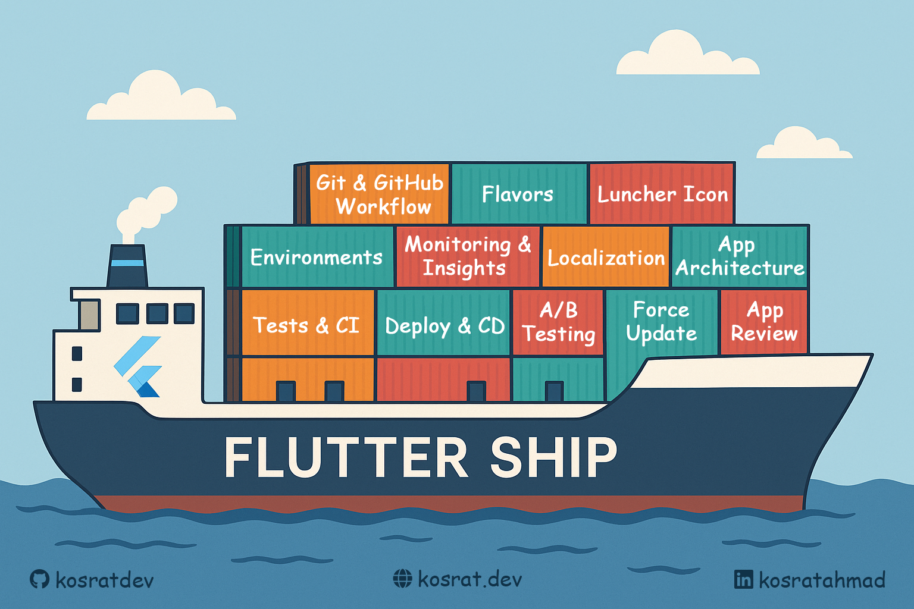

# Simple Todo App

A production-ready Flutter todo application demonstrating best practices for building scalable, maintainable Flutter apps. This project serves as the practical companion to the **[Flutter Ship](https://kosrat.dev/posts/flutter-ship/)** tutorial series.

## 📚 About Flutter Ship Series



This repository accompanies the comprehensive **Flutter Ship** tutorial series, which guides Flutter developers through building production-ready applications. Each branch in this repository corresponds to a specific article in the series.

### 📖 Tutorial Articles

1. **[Flutter Ship 01: Git & GitHub Workflow](https://kosrat.dev/posts/flutter-ship/git-github/)** ✅
2. **Flutter Ship 02: Flavors** 🔄 _(Coming Soon)_
3. **Flutter Ship 03: Launcher Icon** 🔄 _(Planned)_
4. **Flutter Ship 04: Splash Screen** 🔄 _(Planned)_
5. **Flutter Ship 05: Environments** 🔄 _(May Be!)_
6. **Flutter Ship 06: Monitoring & Insights** 🔄 _(May Be!)_
7. **Flutter Ship 07: Localization** 🔄 _(May Be!)_
8. **Flutter Ship 08: App Architecture** 🔄 _(May Be!)_
9. **Flutter Ship 09: More Sections** 🔄 _(May Be)_

## 🚀 Getting Started

### Prerequisites

- Flutter SDK (3.8.0 or later)
- Dart SDK
- Git
- Your favorite IDE (VS Code, Android Studio, IntelliJ)

### Installation

1. **Clone the repository:**

   ```bash
   git clone https://github.com/kosratdev/simple_todo.git
   cd simple_todo
   ```

2. **Install dependencies:**

   ```bash
   flutter pub get
   ```

3. **Run the app:**
   ```bash
   flutter run
   ```

## 🛠️ Production Features Implemented

### ✅ Git & GitHub Workflow (Branch: `01-git-github-workflow`)

- **Branching Strategy**: GitHub Flow for clean, predictable development
- **Commit Standards**: Conventional Commits for clean history and automated changelog generation
- **Local Quality Checks**:
  - Pre-commit: Auto-fix, format, and lint Dart code
  - Commit-msg: Commit message validation
  - Pre-push: Run tests before pushing
- **GitHub PR Checks**: GitHub Actions for automated PR checks
- **Changelog**: Automated generation with Git Cliff
- **Git Hooks**: Managed with Lefthook for team consistency

### 🔄 Coming Soon

- **Multi-flavor setup** for different environments
- **Custom launcher icons** and branding
- **Splash screen** implementation
- **Environment management** and configuration
- **Monitoring and analytics** integration
- **Internationalization** (i18n) support
- **Clean architecture** implementation

## 📱 App Features

The Simple Todo App includes:

- ✅ Clean, Material Design UI
- ✅ Add, edit, and delete todos
- ✅ Mark todos as complete/incomplete
- ✅ Persistent local storage
- ✅ Search and filter functionality
- ✅ Dark/Light theme support

## 🏗️ Project Structure

```
simple_todo/
├── lib/
│   ├── main.dart              # App entry point
│   ├── models/                # Data models
│   ├── screens/               # UI screens
│   ├── widgets/               # Reusable widgets
│   └── services/              # Business logic & services
├── test/                      # Unit and widget tests
├── scripts/                   # Development scripts
├── .github/
│   └── workflows/             # GitHub Actions
├── lefthook.yml               # Git hooks configuration
├── cliff.toml                 # Changelog configuration
└── analysis_options.yaml      # Dart analyzer rules
```

## 🧪 Testing

Run the test suite:

```bash
# Run all tests
flutter test

# Run tests with coverage
flutter test --coverage

# Run specific test file
flutter test test/models/todo_test.dart
```

## 🤝 Contributing

This is a tutorial project, but contributions are welcome! Please:

1. Fork the repository
2. Create a feature branch (`git checkout -b feature/amazing-feature`)
3. Commit using conventional commits (`git commit -m 'feat: add amazing feature'`)
4. Push to the branch (`git push origin feature/amazing-feature`)
5. Open a Pull Request

## 📝 License

This project is open source and available under the [MIT License](LICENSE).

## 👨‍💻 Author

**Kosrat Ahmed**

- Website: [kosrat.dev](https://kosrat.dev)
- GitHub: [@kosratdev](https://github.com/kosratdev)
- LinkedIn: [kosratahmad](https://linkedin.com/in/kosratahmad)
- Email: kosrat.d.ahmad@gmail.com

## 🙏 Acknowledgments

- Flutter team for the amazing framework
- The open-source community for the excellent tools and libraries
- All contributors to the Flutter Ship tutorial series

---

⭐ **Star this repository** if you find it helpful, and follow along with the [Flutter Ship series](https://kosrat.dev/posts/flutter-ship/) for more production-ready Flutter insights!

_"Coffee, code, and crushing mobile challenges. Let's build something great!"_ ☕️
